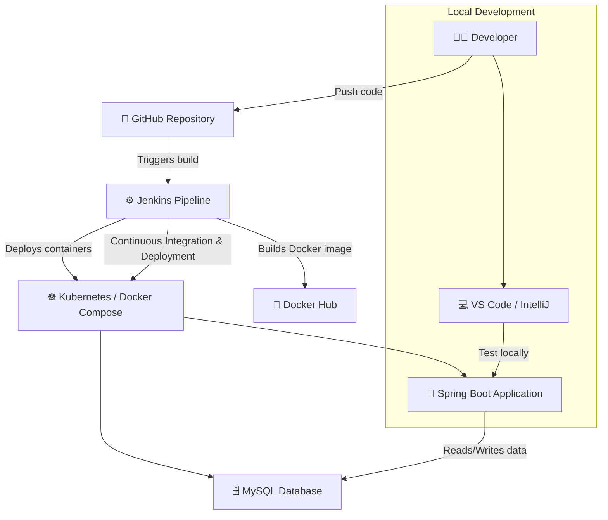

# Spring Boot Login/Register App with MySQL

A simple full-stack web application built with Spring Boot, Thymeleaf, and MySQL. It supports user registration and login, and runs inside Docker containers using Docker Compose.


## Tech Stack

- **Backend**: Spring Boot (Java 17), Spring Data JPA  
- **Frontend**: Thymeleaf, HTML/CSS  
- **Database**: MySQL 8  
- **Containerization**: Docker, Docker Compose  
- **Build Tool**: Maven  
- **CI/CD**: Jenkins

## 📦 Project Structure  
```bash
📦 spring-boot-webapp/
├── 📁 src/
│ ├── 📁 main/
│ │ ├── 📁 java/com/example/demo/
│ │ │ ├── 🚀 DemoApplication.java – Main entry point of the Spring Boot application
│ │ │ ├── 👤 User.java – Entity class representing a user
│ │ │ ├── 💾 UserRepository.java – Repository interface for CRUD operations
│ │ │ ├── 🔐 LoginController.java – Handles login-related requests
│ │ │ └── 📝 RegisterController.java – Handles user registration requests
│ │ └── 📁 resources/
│ │ ├── 📁 templates/
│ │ │ ├── 🔑 login.html – Login page (Thymeleaf template)
│ │ │ ├── 🧾 register.html – Registration page (Thymeleaf template)
│ │ │ └── 🏠 home.html – Home page after successful login
│ │ └── ⚙️ application.properties – Configuration for database, server port, etc.
├── 🐳 Dockerfile – Defines container build instructions for the application
├── 🐙 docker-compose.yml – Runs the app and MySQL together using Docker Compose
├── 📘 pom.xml – Maven build configuration and dependencies
└── ⚙️ Jenkinsfile – CI/CD pipeline definition for Jenkins
```


## 🔄 Application Architecture & CI/CD Flow




## Deployment⚙️ Setup Instructions

### 🪜 1. Clone the Repository

```bash
 git clone https://github.com/your-username/spring-boot-webapp.git
 cd spring-boot-webapp
```

### 🧱 2. Build the Project
```bash
mvn clean package
```
### 🐳 3. Run with Docker Compose
```bash
docker-compose up --build
```
### 🌐 4. Access the Application

- 📝 Register: http://localhost:8080/register
- 🔐 Login: http://localhost:8080/login

## 🧪 Jenkins CI/CD

This project includes a Jenkinsfile for automated build and deployment.
The pipeline performs the following stages:

- 🧰 Build – Compiles the Spring Boot application using Maven
- 🐳 Dockerize – Builds and pushes the Docker image to Docker Hub

- 🚀 Deploy – Deploys the containers via Docker Compose
- ❤️ Health Check – Verifies the application is running using curl
 ## 🌍 Environment Variables
 Defined in your docker-compose.yml file:

  `MYSQL_ROOT_PASSWORD`= rootpass --> Root password for MySQL
  
` MYSQL_DATABASE ` = userdb --> Database name

`MYSQL_USER`= springuser --> Database username	

` MYSQL_PASSWORD` = springpass --> Database user password
    
## Run

After running the app, you can verify containers with:

```bash
  docker ps

```
And stop everything cleanly with:

```bash
 docker-compose down

```

## Notes
- Both **Spring Boot** and **Jenkins** use port **8080** by default.  
  To avoid conflicts, change one of them as follows:


## ⚙️  Change Jenkins Port
Linux/Mac:

Edit the Jenkins configuration file:

```bash
  sudo vi /etc/default/jenkins

```

Find this line:

```bash
 HTTP_PORT=8080

```
Change it to:

```bash
 HTTP_PORT=9090

```

Then restart Jenkins:

```bash
  sudo systemctl restart jenkins

```

Afterward, access Jenkins at:

- http://localhost:9090
## Authors

- Biswajit pattanaik
- Email : biswajitpattanaik453@gmail.com


## 🛠️ Tech Stack

<p align="center">
  
  
  
  
  
</p>

